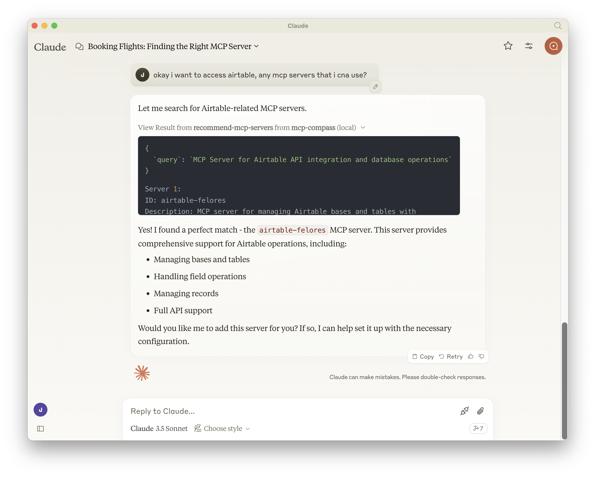

# MCP Compass 🧭

[](https://modelcontextprotocol.org)

<a href="https://glama.ai/mcp/servers/85uxmq6wx7"></a>

## MCP Discovery & Recommendation

### Experience MCP Compass 🌐

You can now experience MCP discovery directly on our website!  
👉 **[Explore MCP Compass](https://mcphub.io/)** 👈  

Dive in to discover the power of MCP services in action with real-time recommendations and insights.

---

## What is this? 🤔

MCP Compass is a discovery & recommendation service that helps you explore Model Context Protocol servers. It acts as a smart guide that helps AI assistants find and understand available MCP services out there based on **natural language queries**, making it easier to discover and utilize the right tools for specific tasks.

### Quick Example
<div align="center">
  
</div>

## Features 🌟

- 🔍 **Smart Search**: Find MCP services using natural language queries
- 📚 **Rich Metadata**: Get detailed information about each service
- 🔄 **Real-time Updates**: Always up-to-date with the latest MCP services [](https://github.com/modelcontextprotocol/servers)
- 🤝 **Easy Integration**: Simple to integrate with any MCP-compatible AI assistant

## Quick Start 🚀

### Usage

1. Clone the repository

or 

2. Use `npx`


### Installation

For Claude Desktop, edit your `claude_desktop_config.json` file:

#### MacOS/Linux
``` bash
code ~/Library/Application\ Support/Claude/claude_desktop_config.json
```

#### Windows
``` bash
code $env:AppData\Claude\claude_desktop_config.json
```

1. **As an MCP Service**:

   Add to your AI assistant's MCP configuration to enable service discovery capabilities.
   

   ``` json
   {
   "mcpServers": {
      "mcp-compass": {
         "command": "npx",
         "args": [
            "-y",
            "@liuyoshio/mcp-compass"
         ]
      }
   }
   }
   ```

   or

   ``` json
   {
   "mcpServers": {
      "mcp-compass": {
         "command": "node",
         "args": [
            "/path/to/repo/build/index.js"
         ]
      }
   }
   }
   ```


## License 📝

MIT License - See [LICENSE](LICENSE) file for details.

## Support 💬

- 🐛 [Report issues](https://github.com/liuyoshio/mcp-compass/issues)
- 💡 [Feature requests](https://github.com/liuyoshio/mcp-compass/issues)
- 📖 [Documentation](https://github.com/liuyoshio/mcp-compass)

